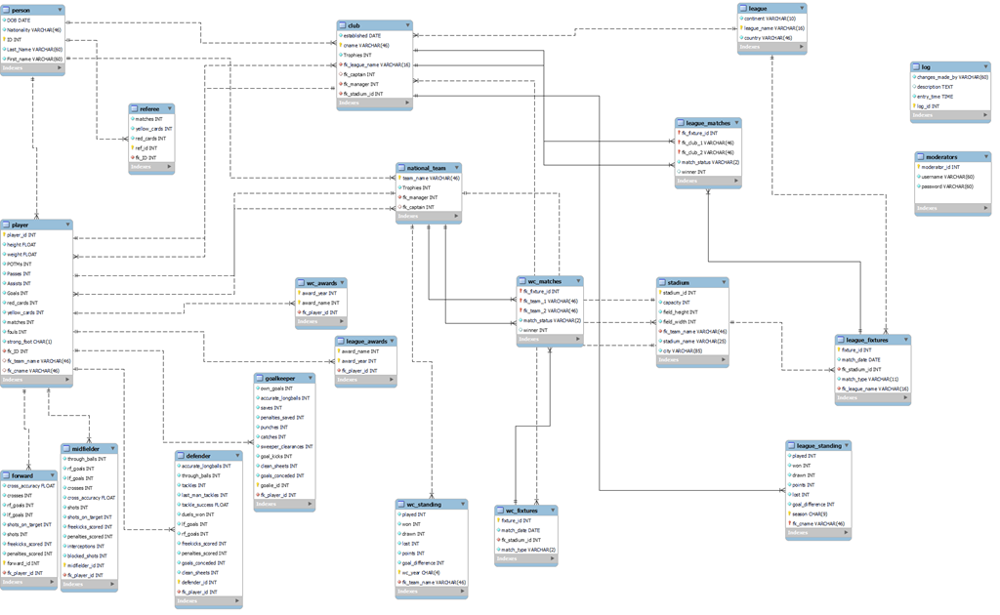

# Football-Database

Semester Project for CS-220 Database Systems.

### Group Members

* Muhammad Umar Asad
* Muhammad Taha Naveed
* Muhammad Danish

### Description

Implementation of an International Football Database with front-end deployed on React 

framework of JS. Database connection is handled through NodeJS which authenticates

and connects to MySQL Back-end Database. The schema and structure of MySQL database

is defined inside the Database folder.

### ERR

